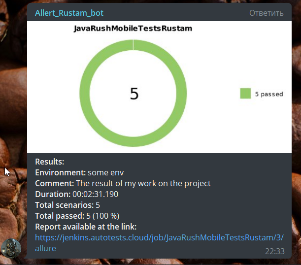
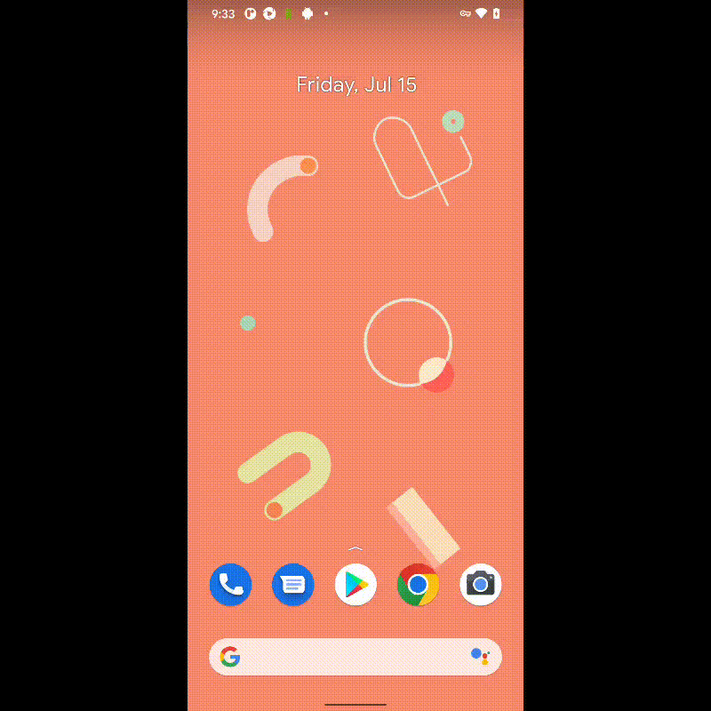

# Проект по автоматизации тестирования 
## <a target="_blank" href="https://trashbox.ru/files20/1639225_a5b1ad/com.hitechrush.jaxarush_1.0.65_100065.apk">мобильного приложения JavaRush</a>


## :rocket: Содержание:

- [x] <a href="#rocket-технологии-и-инструменты">Технологии и инструменты</a>
- [x] <a href="#rocket-реализованные-проверки">Реализованные проверки</a>
- [x] <a href="#rocket-сборка-в-Jenkins">Сборка в Jenkins</a>
- [x] <a href="#rocket-запуск-из-терминала">Запуск из терминала</a>
- [x] <a href="#rocket-allure-отчет">Allure отчет</a>
- [x] <a href="#rocket-интеграция-с-allure-testops">Интеграция с Allure TestOps</a>
- [x] <a href="#rocket-интеграция-с-jira">Интеграция с Jira</a>
- [x] <a href="#rocket-отчет-в-telegram">Отчет в Telegram</a>
- [x] <a href="#rocket-Результаты-тестов-в-BrowserStack">Результаты тестов в BrowserStack</a>
- [x] <a href="#rocket-видео-примеры-прохождения-тестов">Видео примеры прохождения тестов</a>

## :rocket: Технологии и инструменты
<p align="center">


</p>

## :rocket: Реализованные проверки

- Проверка информации на страницах обучения
- Проверка элементов главной страницы
- Проверка отображения элементов титульной страницы
- Проверка отображения элементов страницы с выбором языка
- Проверка отображения элементов страницы выбора профессии

## :rocket: Сборка в Jenkins
### <a target="_blank" href="https://jenkins.autotests.cloud/job/Lesson_20_mobile_tests_part2/">Сборка в Jenkins</a>
<p align="center">

</p>

### Параметры сборки в Jenkins:
Сборка в Jenkins

- устройство, по умолчанию Pixel 4 API 30
- версия ОС, по умолчанию Android 11.0

## :rocket: Запуск из терминала
Локальный запуск:
```
gradle clean android -Dhost=(browserStack/realDevice/androidEmulator)
```

Удаленный запуск:
```
clean
android
"-Dhost=${HOST}"
```

## :rocket: Allure отчет
- ### Главный экран отчета
<p align="center">

</p>

- ### Проведенные тесты (suites)
<p align="center">


</p>

- ### Пакеты тестов
<p align="center">

</p>

- ### График прохождения тестов
<p align="center">

</p>

## :rocket: Результаты тестов в BrowserStack
- ### Как можно загрузить свое приложение
<p align="center">

</p>

- ### Как можно увидеть процесс запуска тестов
<p align="center">

</p>

- ### Параметры необходимых для запуска тестов
<p align="center">

</p>

- ### Текстовые логи в BrowserStack
<p align="center">

</p>

- ### Логи устройства в BrowserStack
<p align="center">

</p>

- ### Состояние устройства в BrowserStack
<p align="center">

</p>

## :rocket: Интеграция с Allure TestOps
- ### Результаты запуска тестов
<p align="center">

</p>

- ### Выводом ошибок после запуска тестов
<p align="center">

</p>

- ### Launches после интеграции с IDE + график
<p align="center">

</p>

- ### Дашборды с ручными и авто тестами
<p align="center">

</p>

- ### Тест кейсы
<p align="center">

</p>

- ### Запуски с ручными и авто тестами
<p align="center">

</p>

## :rocket: Интеграция с Jira
- ### Задача в Jira
<p align="center">

</p>

## :rocket: Отчет в Telegram
<p align="center">

</p>

Локальный запуск:
```
java "-DconfigFile=notifications/telegram.json" -jar allure-notifications-4.2.0.jar

```

## :rocket: Видео примеры прохождения тестов
> К каждому тесту в отчете прилагается видео. Одно из таких видео представлено ниже.
<p align="center">
  
</p>


